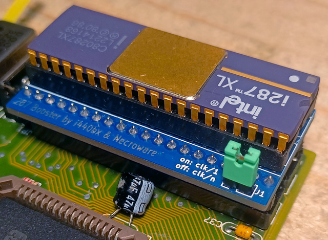

# 287 Booster

This is an interposer which adds a jumper which can be used to select the clock
divider on a 287 floating point unit. It was designed and open sourced in
cooperation with the user i440bx from the German dosreloaded.de community.

## Background

Intel 287 co-processors have configuration pin 39 for the clock mode signal
(CKM) setup. When this pin is pulled up the chip will use the clock directly. If
it is pulled to ground the chip will use a clock divider. The pin has internal
pull-down resistor, so it can be left unconnected, which will default the
setting to divided clock. Which divider will be used depends on the chip:

- Intel D80287, M80287 run at 1/3 of the clock
- Intel i287XL runs at 1/2 of the clock
- AMD D80C287 runs at 1/3 of the clock

